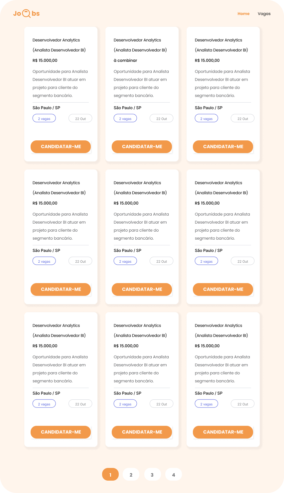

# ✨ Objetivo:

- **Desafio:** Web Scrapping + Processamento de Texto
- **Funcionalidades:** API Java Scrapping
- **Alvo:** Vagas (unorderned - endpoint: `https://www.vagas.com.br/vagas-de-'VALUE'`)
- **Assuntos:** Web Crawler, Java Web Scraping, Java Parse HTML

<b>📒 Regras de Negócio</b>

## Requisitos:
### 1. Vaga
  - private String cargo;
	- private String linkVaga;
	- private String empresa;
	- private String nivelVaga;
	- private String detalheVaga;
	- private String localidade;
	- private String dataPublicacao;

### 2. Páginas (Front)
- Página Home: `domain.com`
- Página Vaga: `domain.com/vagas?pesquisa='VALUE'`

### Tecnologias e Libs
- Angular
- Java
- JSoup: `https://jsoup.org/`

### Design
#### Página Home

 #### Página Vagas

<h2>🦄 Autores</h2>

<table>
  <tr>
    <td align="center">
      <a href="https://github.com/bhigoreduardo">
         
        
          <b>Higor Eduardo</b>
        
      </a>
    </td>
  </tr>
  <tr>
    <td align="center">
      <a href="https://github.com/NickyWasHere">
         
        
          <b>Nicolas</b>
        
      </a>
    </td>
  </tr>
  <tr>
    <td align="center">
      <a href="https://github.com/Patrick-MarquesV">
         
        
          <b>Patrick Marques</b>
        
      </a>
    </td>
  </tr>
  <tr>
    <td align="center">
      <a href="https://github.com/theJoseAlan">
         
        
          <b>José</b>
        
      </a>
    </td>
  </tr>
</table>
